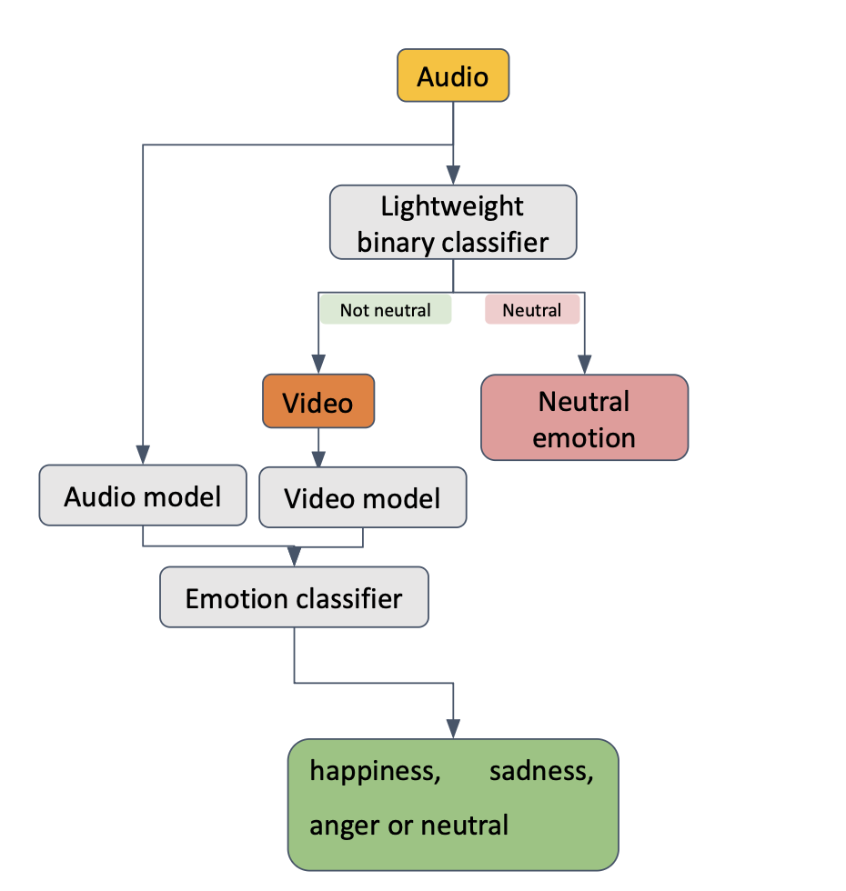
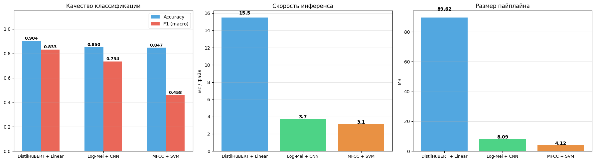
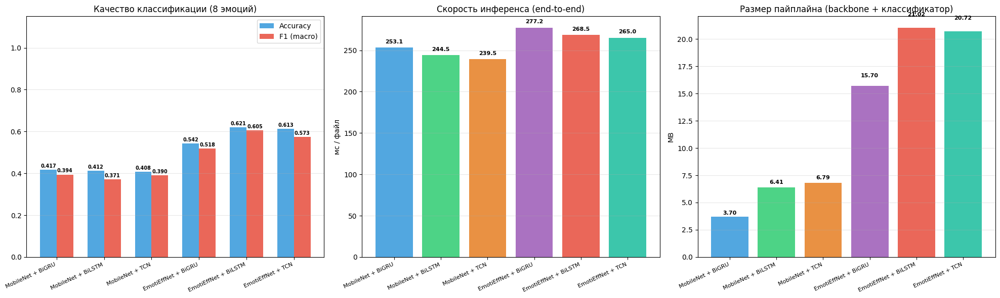

# Classification of Facial Expressions with Detection of Emotions in Speech

Дипломная работа по созданию эффективной двухэтапной системы распознавания эмоций в реальном времени, объединяющей аудио и видео модальности (MER).

---

## Цель и задачи

**Цель:** Разработать ресурсно-эффективную систему мультимодального распознавания эмоций для применения в реальном времени (видеоконференции, онлайн-звонки).

  

**Задачи:**
1. Реализовать лёгкий бинарный аудиоклассификатор (нейтральная / эмоциональная речь)
2. Обучить видеомодуль распознавания 7 эмоций, активируемый только при обнаружении ненейтральных сегментов
3. Сравнить двухэтапный подход с синхронными базовыми линиями по точности и вычислительным затратам

---

## Актуальность

Современные MER-архитектуры обрабатывают обе модальности на каждом кадре, включая периоды молчания и эмоционально нейтральной речи. Это приводит к избыточной нагрузке на GPU и делает развёртывание в мобильных и облачных приложениях дорогостоящим.

**Ключевая идея:** реальные разговорные данные преимущественно нейтральны — активация тяжёлого визуального модуля только в ненейтральные моменты позволяет сократить вычислительные затраты примерно на 50%, сохраняя при этом качество классификации.

---

## Текущий этап

| Этап | Статус |
|------|--------|
| Аудио: бинарная классификация (neutral vs. non-neutral) на RAVDESS + CREMA-D | Завершён |
| Видео: 7-классовая классификация эмоций на RAVDESS | Завершён |
| Полный пайплайн на RAVDESS | Завершён |
| Парсинг и препроцессинг IEMOCAP | Завершён |
| Real-time демо (VAD + визуальный модуль) | Завершён |
| Обучение на IEMOCAP | **В процессе** |
| Дотюнивание гиперпараметров моделей | **В процессе** |
| Сравнение с базовыми линиями | **Предстоит** |

---

## Аудио модели

Задача: **бинарная классификация** — нейтральная (0) vs. эмоциональная речь (1).

Обучены на: **RAVDESS + CREMA-D** с независимым по спикерам разбиением (~20% спикеров в тестовой выборке).

| Модель | Признаки | Описание |
|--------|----------|----------|
| **DistilHuBERT + Linear** | 768-мерные эмбеддинги | `ntu-spml/distilhubert`, предобученный на речи; линейный классификатор поверх усреднённых скрытых состояний |
| **Log-Mel + CNN** | 64 мел-фильтра, 128 временных шагов | 2D-сверточная сеть над лог-мел-спектрограммой; нормализация по обучающей выборке |
| **MFCC + SVM** | 40 MFCC | Классический подход: радиальное ядро SVM со StandardScaler |

Веса сохранены в `trained_models/audio_neutral_{0,1,2}/`, лучшая версия - последняя.

---

## Видео модели

Задача: **7-классовая классификация** эмоций (neutral, happy, sad, angry, fearful, disgust, surprised).

Обучены на: **RAVDESS**, 16 кадров на клип, размер изображений 224×224.

Пайплайн: **Видео → детекция лиц (MediaPipe) → CNN backbone → темпоральная агрегация → классификация эмоции**

### Backbone (feature extraction)

| Backbone | FEAT_DIM | Размер |
|--------|----------|--------|
| **MobileNetV3-Small** | 576 | ~2.5 МБ |
| **EfficientNet-B0** | 1280 | ~5 МБ |

### Классификационные модели

| Голова | Описание |
|--------|----------|
| **Attention Pooling** | Взвешенное суммирование кадровых признаков через softmax-веса |
| **BiLSTM** | Двунаправленный LSTM, обрабатывающий последовательность кадров |
| **Transformer** | Энкодер-блок с позиционным кодированием; `OneCycleLR` для стабильного обучения |

Итого **6 комбинаций** (2 Backbone × 3 модели). Веса сохранены в `trained_models/video_emotion/`.

---

## Датасеты

| Датасет | Описание | Размер | Путь |
|---------|----------|--------|------|
| **RAVDESS** | Разыгранная эмоциональная речь и пение, 8 эмоций, американский английский | 24 актёра | `datasets/orvile/ravdess-dataset/` |
| **CREMA-D** | Разыгранные эмоциональные фразы, 6 эмоций | 91 актёр | `datasets/crema-d/` |
| **IEMOCAP** | Диадические разговорные видео с лейблами на уровне высказываний, 6 эмоций | ~12 ч диалогов | `datasets/IEMOCAP_full_release/` |
| **MELD** | Диалоги из сериала «Друзья», 7 эмоций, 3 модальности | ~1400 диалогов | `datasets/MELD.Raw/` |

---

## Гипотезы

**H1 (Эффективность):** Двухэтапная система с аудиогейтингом сокращает общее время GPU по сравнению с синхронными базовыми линиями за счёт пропуска визуальной обработки на нейтральных сегментах.

**H2 (Качество аудио):** DistilHuBERT + Linear превзойдёт Log-Mel CNN и MFCC SVM в бинарной задаче neutral/non-neutral благодаря более богатым контекстуальным представлениям речи. Однако Log-Mel CNN будет близка по качеству, и значительно лучше по скорости и памяти.

**H3 (Качество видео):** Легковесные архитектуры (MobileNetV3-Small) с правильным темпоральным агрегированием (Attention/BiLSTM/Transformer) достигают сопоставимого с тяжёлыми моделями качества при значительно меньшей латентности.

---

## Основные файлы

- [Аудио: обучение и оценка](notebooks/audio_neutral_check.ipynb)
- [Видео: обучение и оценка](notebooks/video_emotion_classification.ipynb)
- [Полный пайплайн на RAVDESS](notebooks/full_pipeline_ravdess.ipynb)
- [Полный пайплайн на IEMOCAP](notebooks/full_pipeline_iemocap.ipynb)

---

## Промежуточные выводы

### Аудио модели (RAVDESS + CREMA-D, бинарная задача)

  

| Модель | Accuracy | F1 macro | Инференс | Размер |
|--------|----------|----------|----------|--------|
| DistilHuBERT + Linear | 0.9038 | 0.8327 | 15.5 мс/файл | 89.6 МБ |
| Log-Mel + CNN | 0.8501 | **0.7345** | 3.7 мс/файл | 8.1 МБ |
| MFCC + SVM | 0.8466 | 0.4585 | 3.1 мс/файл | 4.1 МБ |

### Видео модели (RAVDESS, 7-классовая задача)

  

| Модель | Accuracy | F1 macro | Инференс | Размер пайплайна |
|--------|----------|----------|----------|------------------|
| MobileNet + Attention | 0.3333 | 0.2782 | 249 мс/файл | 4.0 МБ |
| MobileNet + BiLSTM | 0.3833 | 0.3737 | 259 мс/файл | 6.4 МБ |
| MobileNet + Transformer | 0.3292 | 0.2925 | 241 мс/файл | 6.3 МБ |
| EfficientNet + Attention | 0.3917 | 0.3465 | 266 мс/файл | 16.4 МБ |
| EfficientNet + BiLSTM | 0.3958 | 0.3765 | 266 мс/файл | 21.0 МБ |
| EfficientNet + Transformer | 0.4042 | 0.3448 | 265 мс/файл | 18.8 МБ |

### Полный пайплайн

| Датасет | Accuracy | F1 macro | Аудио-гейт Acc | % → видео | Время (мс/файл) |
|---------|----------|----------|----------------|-----------|-----------------|
| **RAVDESS** | **0.8187** | **0.8130** | 0.9257 | 74.5% | 291.7 |
| **IEMOCAP** | **0.1093** | **0.0748** | 0.6986 | 96.7% | 526.6 |

---

## Проверка гипотез

**H1 (Эффективность) — частично подтверждена.**
На RAVDESS 25.5% видео маршрутизировалось в нейтральную ветвь, минуя видеоклассификатор. Реальная экономия ~25%, как предполагалось.

**H2 (Качество аудио) — подтверждена.**
DistilHuBERT + Linear достиг F1=0.8327 против F1=0.7345 у Log-Mel CNN. При этом CNN в 4× быстрее и в 11× легче, что делает её выбором для боевого пайплайна. MFCC+SVM неожиданно слаб по macro F1 (0.4585) — классический признак того, что модель не справляется с редким классом.

**H3 (Качество видео) — частично подтверждена.**
EfficientNet-B0 незначительно превосходит MobileNetV3-Small (F1 0.38 vs 0.37, Acc 0.40 vs 0.38) при сопоставимом времени инференса (~265 мс). Ни один Transformer не обыгрывает BiLSTM значительно. Разница Backbone нивелируется малым объёмом обучающих данных.

---

## Ключевые наблюдения

**1. Domain shift — главная проблема.**
Модели, обученные на разыгранных данных (RAVDESS, CREMA-D), теряют качество на естественной речи (IEMOCAP): accuracy падает с 0.82 до 0.11. Это фундаментальное ограничение, которое не решается архитектурными улучшениями без кросс-датасетного обучения.

**2. Аудио-гейт ведёт себя по-разному в зависимости от домена.**
В RAVDESS 74.5% реплик помечается как эмоциональные — ожидаемо для разыгранных данных. В IEMOCAP — 96.7%, что указывает на то, что аудиомодель, обученная на актёрской речи, не умеет распознавать нейтральность в живых диалогах.

**3. Log-Mel CNN — оптимальный выбор для гейтинга.**
При незначительном отставании от DistilHuBERT (Acc 0.85 vs 0.90) CNN в 24× меньше по размеру, в 4× быстрее и не требует загрузки предобученного трансформера. Для задачи бинарного гейтинга этот трейдофф оправдан.

**4. Малый датасет — узкое место видеомоделей.**
RAVDESS содержит всего 24 актёра. При speaker-independent split тестовая выборка — 240 примеров на 7 классов (~34 на класс). В таких условиях различия между архитектурами статистически ненадёжны.

**5. Нейтральный класс — системная сложность видеомодуля.**
На RAVDESS нейтральных видео в 2× меньше других эмоций (96 vs 192). В полном пайплайне это решается архитектурно: нейтральные реплики перехватывает аудио-гейт, не доходя до видеоклассификатора.
