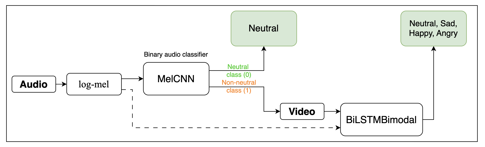
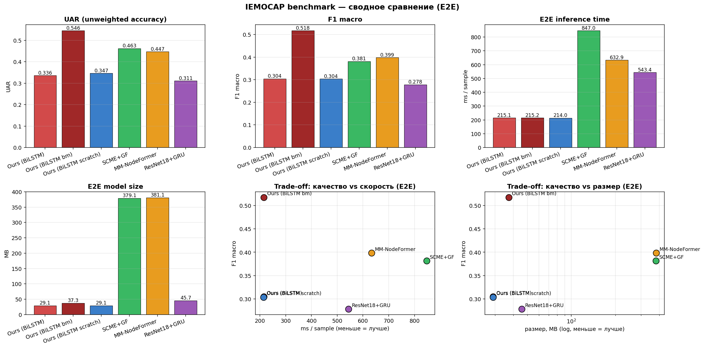
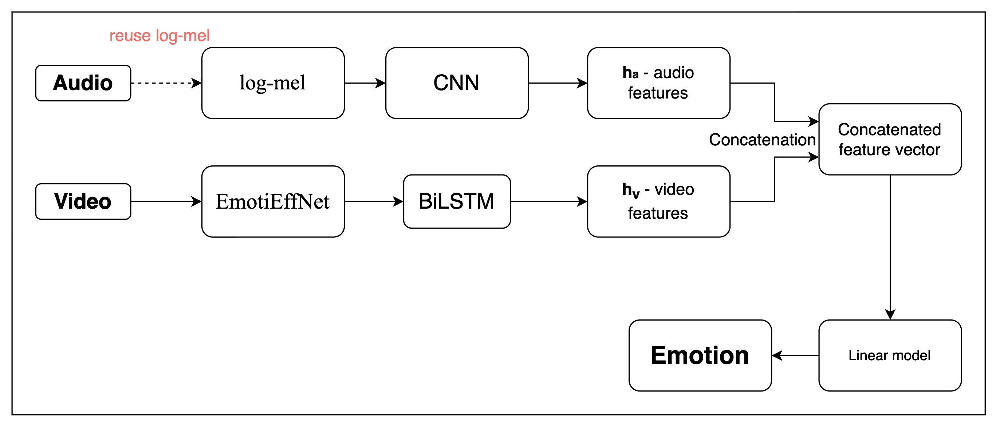

# An Audio-Gated Cascade for Resource-Efficient Multimodal Emotion Recognition

This repository accompanies the SPECOM-2026 paper
**"An Audio-Gated Cascade for Resource-Efficient Multimodal Emotion Recognition"**
by **Damir R. Kandelov** and **Lyudmila V. Savchenko** (HSE University, Nizhny Novgorod).

> **Note on the repository name.** This repository was originally created under the
> name *Classification-of-Facial-Expressions* and now hosts the full audio-gated
> multimodal cascade described in the paper.

<p align="center">
  
</p>

## Overview

Most multimodal emotion recognition (MER) systems process **both** modalities on
every frame — including silence and emotionally neutral speech — which wastes
computation and makes deployment on mobile, embedded, and edge devices expensive.
Real conversational data, however, is *predominantly neutral*. We exploit this with
a two-stage cascade that only activates the heavy visual branch when it is needed:

1. **Stage 1 — Audio gate.** A lightweight binary `MelCNN` classifier operating on a
   `(1, 64, 128)` log-mel spectrogram decides whether an utterance is *neutral* or
   *non-neutral*. If neutral, inference **stops immediately** and the visual pipeline
   is never executed.
2. **Stage 2 — Bimodal head.** Only for non-neutral utterances, a four-class
   audio + video head (EmotiEffNet features → BiLSTM video branch, late-fused with an
   audio branch) predicts the final emotion among `{neutral, happy, sad, angry}`. The
   audio branch **reuses the same log-mel spectrogram** already computed by the gate,
   so no self-supervised audio encoder (Wav2Vec 2.0 / HuBERT) is ever loaded at
   inference.

This brings the end-to-end model down to **≈37.3 MB** — roughly **10× smaller** and
**~3× faster** than the closest multimodal competitors (which carry a Wav2Vec 2.0
encoder, ≈379–382 MB, ≈610 ms/utterance) — while reaching a **UAR of 0.5094** on
four-class IEMOCAP under a strict speaker-independent LOSO protocol. A streaming
prototype short-circuits neutral phrases in **under 10 ms** on Apple Silicon.

## Key results (IEMOCAP, 4-class, 5-fold LOSO)

Mean ± std over the five leave-one-session-out folds. UAR (unweighted accuracy) is
the primary metric. *Size* is the end-to-end footprint actually loaded at inference
(classifier head **+** every backbone the production pipeline runs); *time* is
end-to-end per utterance from raw `wav`+`avi`.

| Model | Modalities | UAR ↑ | Macro-F1 ↑ | WA ↑ | Size (MB) ↓ | Time (ms) ↓ |
|---|---|---|---|---|---|---|
| **Ours (BiLSTM bimodal, hard skip)**         | audio+video | **0.5094 ± 0.0232** | **0.4940 ± 0.0257** | **0.5113 ± 0.0255** | **≈37.3** | **≈216** |
| Ours (BiLSTM bimodal, hard skip, *scratch*)  | audio+video | 0.5048 ± 0.0211 | 0.4921 ± 0.0269 | 0.5086 ± 0.0253 | ≈37.3 | ≈215 |
| GIA-MIC          | audio+video | 0.4910 ± 0.0292 | 0.4658 ± 0.0180 | 0.4739 ± 0.0145 | ≈378.7 | ≈610 |
| SCME+GF          | audio+video | 0.4626 ± 0.0294 | 0.3814 ± 0.0203 | 0.4127 ± 0.0312 | ≈379.1 | ≈612 |
| MM-NodeFormer    | audio+video | 0.4475 ± 0.0173 | 0.3985 ± 0.0395 | 0.4145 ± 0.0392 | ≈381.5 | ≈600 |
| ResNet18+GRU (video-only) | video | 0.3110 ± 0.0450 | 0.2782 ± 0.0498 | 0.3192 ± 0.0480 | ≈45.7  | ≈533 |

The cascade leads every competitor on UAR while being an order of magnitude smaller
and several times faster. The *scratch* variant — all-random initialisation — is the
**shipped production model** (see [Two "Ours" variants](#two-ours-variants) below);
the pretrained-init variant is reported as the headline because it has the highest
mean UAR, but the difference (≈1 p.p.) is within the 5-fold standard deviation.

<p align="center">
  
</p>

### Two "Ours" variants

| Variant | Init | Role |
|---|---|---|
| `Ours (BiLSTM bimodal, hard skip)` | pretrained-init (RAVDESS+CREMA-D video BiLSTM + MelCNN gate weights into the audio branch) | ablation control; best mean UAR |
| `Ours (BiLSTM bimodal, hard skip, scratch)` | all-random | **shipped production model** |

Pretraining did **not** transfer to IEMOCAP improvised speech: on the same folds the
pretrained-init variant was ≈1 p.p. UAR ahead of scratch (within std) but strictly
worse on `happy` F1. We therefore ship the simpler scratch model, and the streaming
demo loads its weights.

## Repository structure

```
.
├── notebooks/                                  # research + benchmark notebooks
│   ├── iemocap_benchmark_4class.ipynb            # MAIN: 4-class LOSO benchmark
│   │                                             #   gate fine-tune + bimodal head
│   │                                             #   + competitors + evaluation
│   ├── audio_neutral_check_augmentation.ipynb    # audio gate pretraining (RAVDESS+CREMA-D)
│   ├── video_emotion_classification_augmentation.ipynb  # video branch pretraining
│   ├── experiments/                              # earlier exploratory notebooks
│   ├── previous_benchmarks/                      # 6-class IEMOCAP benchmarks
│   └── previous_version_{audio,video}/           # superseded model variants
├── real_time_demo/                             # streaming webcam + microphone prototype
│   ├── demo.py                                   # entry point (hard cascade)
│   ├── config.py                                 # checkpoint paths, label space, VAD config
│   ├── capture/{audio_stream,video_stream}.py    # Silero VAD utterance capture + frame buffer
│   ├── models/{mel_cnn,bimodal,pipeline}.py      # gate, bimodal head, inference pipeline
│   └── display/overlay.py
├── trained_models/                             # committed checkpoints
│   ├── iemocap_benchmark_4class/checkpoints/     # per-fold gates + heads (all models)
│   ├── audio_neutral_3_augmentation/             # pretrained MelCNN gate (+ mel stats)
│   └── video_emotion_3_augmentation/             # pretrained video heads
├── raw_models/                                 # MediaPipe BlazeFace / FaceLandmarker
├── results/                                    # per-fold JSON, benchmark table + figures
├── datasets/                                   # raw datasets (gitignored — see below)
├── images/                                     # figures used in this README
├── requirements.txt
└── README.md
```

## Installation

```bash
# clone
git clone https://github.com/Kaparya/Classification-of-Facial-Expressions.git
cd Classification-of-Facial-Expressions

# environment (Python 3.12)
python -m venv venv
source venv/bin/activate
pip install -r requirements.txt
```

**Key dependencies** (full list pinned in `requirements.txt`): `torch==2.10`,
`torchvision`, `torchaudio`, `librosa`, `mediapipe`, `emotiefflib` /`hsemotion`
(EmotiEffNet `enet_b0_8_best_vgaf` backbone), `silero-vad`, `sounddevice`,
`opencv-python`, `transformers`, `scikit-learn`, `pytorch-lightning`. Device
selection is automatic (CUDA → MPS → CPU).

## Datasets

The cascade uses three datasets. They are **not redistributed here** (`datasets/` is
git-ignored) — download them from the original sources and place them under
`datasets/`:

| Dataset | Role | Expected local path |
|---|---|---|
| **RAVDESS** [1] | gate + video-branch pretraining | `datasets/ravdess/` |
| **CREMA-D** [2] | gate + video-branch pretraining | `datasets/crema-d/` |
| **IEMOCAP** [3] | 4-class LOSO benchmark (requires a USC license) | `datasets/IEMOCAP_full_release/` |

For the IEMOCAP benchmark, only **four classes** are used —
`neutral, happy (∪ excited), sad, angry` — under a **leave-one-session-out** 5-fold
protocol (each of the five sessions is the test fold exactly once). On the first run
the benchmark notebook builds a one-time per-utterance feature cache under
`datasets/iemocap_features_cache_v4/` (face crops → frozen EmotiEffNet features) and
an audio cache under `datasets/iemocap_audio_cache_v2/`; later runs reuse them.

## Usage

All commands assume the virtual environment is active (`source venv/bin/activate`).
Training and evaluation are organised as Jupyter notebooks; the streaming prototype
is a standalone script.

```bash
jupyter notebook
```

### 1. Pretraining (RAVDESS + CREMA-D)

| Step | Notebook |
|---|---|
| Audio gate — binary *neutral vs. non-neutral* `MelCNN` | `notebooks/audio_neutral_check_augmentation.ipynb` |
| Video branch — EmotiEffNet + BiLSTM emotion head | `notebooks/video_emotion_classification_augmentation.ipynb` |

These write to `trained_models/audio_neutral_3_augmentation/` and
`trained_models/video_emotion_3_augmentation/`. The released checkpoints are already
committed, so you can skip this stage and go straight to the benchmark.

### 2. Target-domain training + evaluation (IEMOCAP, 4-class LOSO)

```text
notebooks/iemocap_benchmark_4class.ipynb   →  Run All
```

This single notebook reproduces the paper's main results end to end:

- builds the feature/audio caches on first run (slow, one-time);
- **fine-tunes the audio gate per LOSO fold** on the binary IEMOCAP target (the
  global RAVDESS+CREMA-D gate over-fires *neutral* on improvised speech);
- trains the bimodal head and every competitor (GIA-MIC, SCME+GF, MM-NodeFormer,
  ResNet18+GRU) under the hard-cascade inference policy with EMA-smoothed early stop;
- evaluates 5-fold LOSO (UAR / WA / Macro-F1 / per-class F1 + confusion matrices).

Outputs:

- `results/<model>/fold_*.json`, `summary.json` — per-fold and aggregated metrics;
- `results/benchmark_table.csv`, `results/benchmark_summary.png`,
  `results/confusion_matrices.png`;
- `trained_models/iemocap_benchmark_4class/checkpoints/{slug}_{Session}.pt` — per-fold
  head weights, plus `gate_iemocap_{Session}.pt` per-fold fine-tuned gates.

Set `BENCH_QUICK=1` in the environment for a fast 2-epoch smoke run, and use
`MODELS_TO_RERUN` in the runner cell to (re)train a subset of the model zoo.

### 3. Real-time streaming prototype

```bash
python real_time_demo/demo.py        # press Q in the video window to quit
```

The runtime mirrors the benchmark's hard cascade exactly: the per-fold IEMOCAP gate
runs first, `gate.argmax == 0` (neutral) short-circuits the prediction — BlazeFace,
EmotiEffNet, and the bimodal head are all skipped — and on non-neutral the bimodal
head's argmax is the final label. It loads the shipped *scratch* fold by default
(`BIMODAL_SESSION = "Session1"`, the highest test-UA LOSO fold of that variant;
configurable in `real_time_demo/config.py`).

<p align="center">
  
</p>

## Pretrained models

All checkpoints are **committed in this repository** under `trained_models/` — no
external download is required:

- `trained_models/iemocap_benchmark_4class/checkpoints/` — per-fold weights for every
  model in the zoo, plus the per-fold IEMOCAP-fine-tuned gates
  (`gate_iemocap_{Session}.pt`). The shipped streaming model is
  `ours_bilstm_bimodal_hard_skip_scratch_Session1.pt` + `gate_iemocap_Session1.pt`.
- `trained_models/audio_neutral_3_augmentation/` — RAVDESS+CREMA-D pretrained `MelCNN`
  gate and the log-mel normalization statistics (`meta.json`).
- `trained_models/video_emotion_3_augmentation/` — RAVDESS+CREMA-D pretrained video
  heads.

MediaPipe detector assets (`blaze_face_short_range.tflite`, `face_landmarker.task`)
live under `raw_models/`.

## License

The **code** in this repository is released under the [MIT License](LICENSE).

The **datasets** (RAVDESS, CREMA-D, IEMOCAP) and any **pretrained third-party
backbones** (EmotiEffNet, MediaPipe, Wav2Vec 2.0, etc.) are covered by their own
licenses and must be obtained from their original providers. The IEMOCAP corpus in
particular requires a separate license from USC.

## Acknowledgements

This work was carried out at **HSE University, Nizhny Novgorod**. We thank the
authors of RAVDESS, CREMA-D, and IEMOCAP for making their corpora available for
research, and the maintainers of EmotiEffNet, MediaPipe, and Silero VAD.

## References

[1] S. R. Livingstone and F. A. Russo, *The Ryerson Audio-Visual Database of Emotional
Speech and Song (RAVDESS)*, PLoS ONE, 2018.

[2] H. Cao et al., *CREMA-D: Crowd-sourced Emotional Multimodal Actors Dataset*, IEEE
Transactions on Affective Computing, 2014.

[3] C. Busso et al., *IEMOCAP: Interactive Emotional Dyadic Motion Capture Database*,
Language Resources and Evaluation, 2008.
