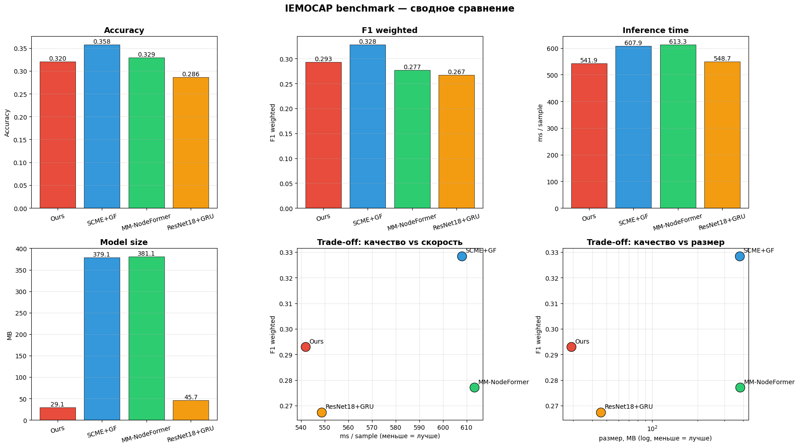

# Классификация выражений лиц с детектированием эмоций в речи

Дипломная работа по созданию эффективной двухэтапной системы распознавания эмоций в реальном времени, объединяющей аудио и видео модальности (MER).

---

## Цель и задачи

**Цель:** Разработать **ресурсно-эффективную** систему мультимодального распознавания эмоций без существенных вычислительных затрат, c высокой скоросью инференса и хорошим качеством (сопоставимым с лучшими моделями).

**Ключевая идея:** реальные разговорные данные преимущественно нейтральны — активация тяжёлого визуального модуля только в ненейтральные моменты позволяет сократить вычислительные затраты, сохраняя при этом качество классификации.

  

**Задачи:**
1. Реализовать лёгкий бинарный аудиоклассификатор (нейтральная / эмоциональная речь)
2. Обучить видеомодуль распознавания 7 эмоций, активируемый только при обнаружении ненейтральных сегментов
3. Сравнить двухэтапный подход с синхронными base line по точности и вычислительным затратам

---

## Актуальность

Современные MER-архитектуры обрабатывают обе модальности на каждом кадре, включая периоды молчания и эмоционально нейтральной речи. Это приводит к избыточной нагрузке на GPU и делает развёртывание в мобильных и облачных приложениях дорогостоящим.

---

## Текущий этап

| Этап | Статус |
|------|--------|
| Аудио: бинарная классификация (neutral vs. non-neutral) на RAVDESS + CREMA-D | Завершён |
| Видео: 7-классовая классификация эмоций на RAVDESS | Завершён |
| Полный пайплайн на RAVDESS | Завершён |
| Парсинг и препроцессинг IEMOCAP | Завершён |
| Real-time демо (VAD + визуальный модуль) | Завершён |
| Обучение на IEMOCAP | Завершён |
| Дотюнивание гиперпараметров моделей | Завершён |
| Сравнение с base line (SCME+GF, MM-NodeFormer, ResNet18+GRU) | Завершён |

---

## Аудио модели

Задача: **бинарная классификация** — нейтральная (0) vs. эмоциональная речь (1).

Обучены на: **RAVDESS + CREMA-D** с независимым по спикерам разбиением (~20% спикеров в тестовой выборке).

| Модель | Описание | Почему выбрана |
|--------|----------|----------------|
| **DistilHuBERT + Linear** | `ntu-spml/distilhubert`, предобученный на речи; линейный классификатор поверх усреднённых скрытых состояний | Сильный self-supervised бэкбон речи — верхняя граница качества при минимальной классификационной голове |
| **Log-Mel + CNN** | 2D-сверточная сеть над лог-мел-спектрограммой | Компромисс между качеством и скоростью — ключевой кандидат на роль лёгкого аудиогейта в реальном времени |
| **MFCC + SVM** | Классический ML подход | Классический baseline для нижней границы качества, чтобы оценить выигрыш нейросетевых подходов |

  

---

## Видео модели

Задача: **7-классовая классификация** эмоций (neutral, happy, sad, angry, fearful, disgust, surprised).

Обучены на: **RAVDESS**, 16 кадров на клип, размер изображений 224×224.

Пайплайн: **Видео => детекция лиц (MediaPipe) => backbone => Классификационная модель => Эмоции**

### Backbone (feature extraction)

| Backbone | FEAT_DIM | Размер | Почему выбран |
|--------|----------|--------|----------------|
| **MobileNetV3-Small** | 576 | ~2.5 МБ | Лёгкая мобильная архитектура |
| **EmotiEffNet** (`enet_b0_8_best_vgaf`) | 1280 | ~15 МБ | Специализированный бэкбон, предобученный на лицевых эмоциях (VGAF) — сильные признаки из коробки |

### Классификационные модели

| Голова | Описание | Почему выбрана |
|--------|----------|----------------|
| **BiGRU** | Двунаправленный двухслойный GRU; агрегация по последним hidden states | Компактная рекуррентная агрегация — меньше параметров чем LSTM при близком качестве на коротких последовательностях |
| **BiLSTM** | Двунаправленный LSTM, обрабатывающий последовательность кадров | Классический стандарт для темпорального моделирования эмоций; эталон для сравнения |
| **TCN** | Temporal Convolutional Network с расширяющимися 1D-свёртками (dilations 1, 2, 4) и глобальным усреднением по времени | Параллелизуемая альтернатива RNN с большим рецептивным полем — быстрее на GPU/CPU, стабильнее градиенты |

Итого **6 комбинаций** (2 Backbone × 3 головы).

  

---

## Датасеты

| Датасет | Описание | Размер | Путь |
|---------|----------|--------|------|
| **RAVDESS** | Разыгранная эмоциональная речь и пение, 8 эмоций, американский английский | 24 актёра | `datasets/orvile/ravdess-dataset/` |
| **CREMA-D** | Разыгранные эмоциональные фразы, 6 эмоций | 91 актёр | `datasets/crema-d/` |
| **IEMOCAP** | Диадические разговорные видео с лейблами на уровне высказываний, 6 эмоций | ~12 ч диалогов | `datasets/IEMOCAP_full_release/` |

---

## Основные файлы

- [Аудио: обучение и оценка](notebooks/audio_neutral_check.ipynb)
- [Видео: обучение и оценка](notebooks/video_emotion_classification.ipynb)
- [Полный пайплайн на RAVDESS](notebooks/full_pipeline_ravdess.ipynb)
- [Полный пайплайн и бенчмарк против конкурентов на IEMOCAP](notebooks/full_pipeline_iemocap.ipynb) — сравнение с SCME+GF, MM-NodeFormer, ResNet18+GRU

---

## Текущие выводы

### Полный пайплайн

| Датасет | Accuracy | F1 macro | Аудио-гейт Acc | % => видео | Время (мс/файл) |
|---------|----------|----------|----------------|-----------|-----------------|
| **IEMOCAP** | **0.3199** | **0.2930** | 0.6986 | 96.7% | 541.9 |

| Модель | Accuracy | F1 weighted | мс/сэмпл | Размер (МБ) | Почему выбрана |
|--------|----------|-------------|----------|-------------|----------------|
| SCME+GF (simplified) | **0.3578** | **0.3284** | 607.9 | 379.1 | Современная SOTA на IEMOCAP с кросс-модальной аттеншн-фьюжн схемой — сильный конкурент по качеству |
| MM-NodeFormer (simplified) | 0.3288 | 0.2772 | 613.3 | 381.1 | Графово-трансформерный подход для MER — проверка, даёт ли сложная топология выигрыш над моей каскадной схемой |
| Ours (MelCNN+EmotiEffNet+BiLSTM) | 0.3199 | 0.2930 | **541.9** | **29.1** | Предлагаемая каскадная архитектура: лёгкий аудиогейт + визуальный модуль только на ненейтральных сегментах |
| ResNet18+GRU (baseline) | 0.2861 | 0.2674 | 548.7 | 45.7 | Классический baseline (ResNet18 по кадрам + GRU) |

### Бенчмарк на IEMOCAP (Session 1–4 train / Session 5 test, 6 классов)

  

> Размер = голова + все бэкбоны, необходимые на инференсе (EmotiEffNet / Wav2Vec2 / ResNet18). Время — end-to-end: raw wav+avi → детекция лица → backbone → голова.

---

## Заключение

В работе разработана и экспериментально проверена ресурсно-эффективная каскадная система мультимодального распознавания эмоций, в которой тяжёлый визуальный модуль активируется только при обнаружении ненейтральной речи лёгким аудиогейтом. Основная идея — перенос вычислительной нагрузки с «каждого кадра» на эмоционально значимые сегменты — подтверждена экспериментально.

**Основные результаты:**

- **Ресурсная эффективность.** Каскадная схема на IEMOCAP работает за 541.9 мс/сэмпл при суммарном размере моделей 29.1 МБ — в **~13× компактнее** SCME+GF (379 МБ) и MM-NodeFormer (381 МБ) и на 60–70 мс быстрее. По сравнению с базовой линией ResNet18+GRU выигрывает и по качеству, и по размеру.
- **Качество, сопоставимое с SOTA.** F1 weighted = 0.2930 уступает только SCME+GF (0.3284) и превосходит MM-NodeFormer (0.2772) и ResNet18+GRU (0.2674) — при радикально меньшем размере. Это подтверждает, что отказ от синхронной обработки обеих модальностей не ведёт к пропорциональной потере качества.
- **Аудиогейт.** Log-Mel CNN выбрана как оптимальный компонент для гейтинга: при небольшом отставании от DistilHuBERT (Acc 0.85 vs 0.90) она в 24× меньше и в 4× быстрее. В домене разыгранной речи (RAVDESS) гейт отбрасывает **25.5% нейтральных реплик**.
- **Видеомодуль.** Комбинация EmotiEffNet + BiLSTM после дообучения на IEMOCAP даёт наилучший баланс качества и скорости. Разница между головами (BiGRU / BiLSTM / TCN) на малых выборках статистически несущественна, однако экспериментально на IEMOCAP были проверны все модели и там эта разница гораздо более ощутима.

**Ограничения и направления развития.**

Ключевое ограничение — domain shift между разыгранными (RAVDESS, CREMA-D) и естественными данными (IEMOCAP): модели теряют качество при переносе, и это не устраняется архитектурными улучшениями. Чувствительность аудиогейта к «нейтральности» в диалогах также снижается на естественной речи. Дальнейшие шаги — кросс-датасетное обучение, адаптация гейта на диалоговых корпусах и расширение визуального модуля за счёт более богатых признаков.

В целом гипотеза об эффективности каскадной архитектуры подтверждается: при кратно меньших ресурсах система остаётся конкурентной по качеству с современными мультимодальными MER-моделями.
